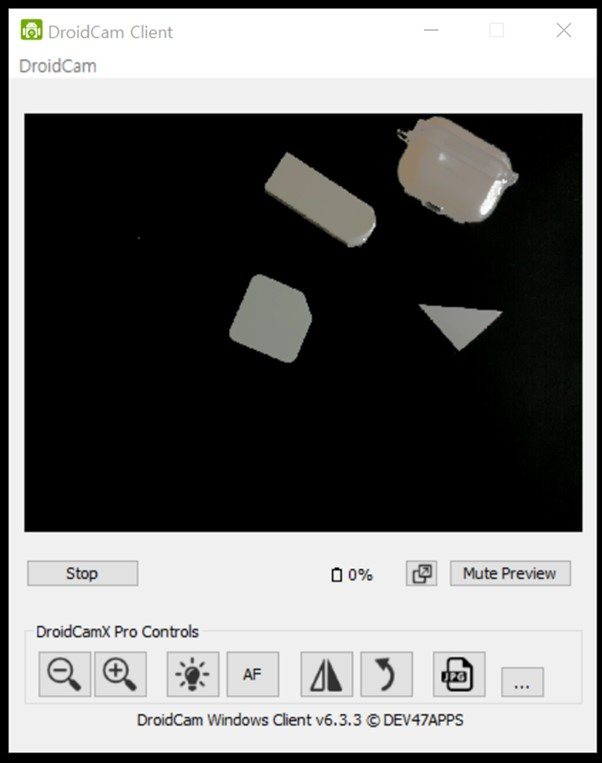
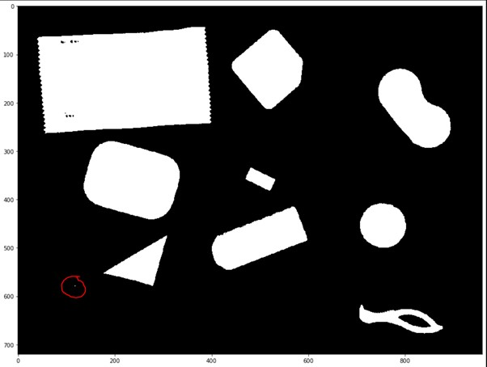
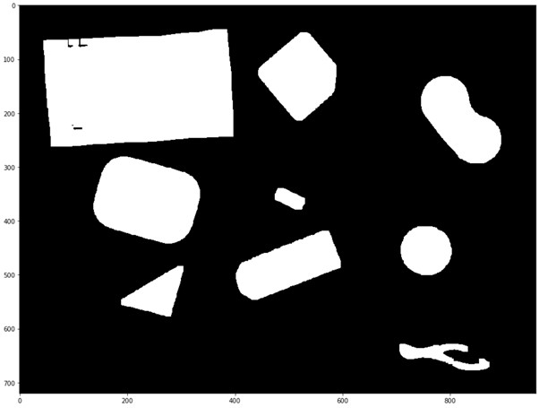
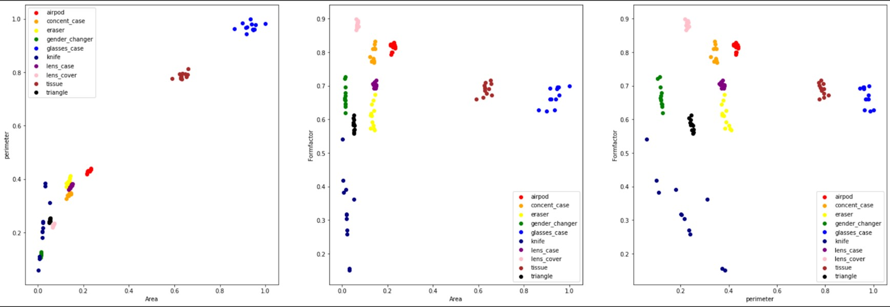
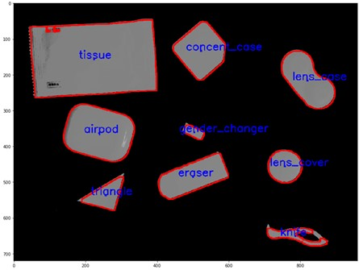

# Object detection

영상 분석 수업의 Final Project로 영상처리를 통한 가장 기본적인 학습을 통한 객체인식 구현

각 물체별로 다양한 Measurements를 측정해 평균값을 기록 후 이를 토대로 새로운 sample에 대해서 올바르게 물체를 분류할 수 있도록 합니다. 

</img>

## Thresholding
- 오브젝트를 구분하기 위해 이미지를 0~255 8bit 이진수 값에서 두가지 종류로 변환하는 과정을 Thresholding라고 합니다(0 과 255로 이진화 수행).
- 이미지를 두 숫자로 나누는 과정에서 기준 점이 필요합니다. 임계 값(Threshold)이라고 불리는 기준치를 통해 더 큰 값들은 255, 작은 값들은 0으로 변환하였습니다.

## Morphological – Erosion, Dilation, Opening, Closing
- Thresholding으로 배경과 오브젝트를 구분하는 과정에서 오브젝트가 아닌 부분이 255로 배치되거나, 오브젝트의 일부분이 0으로 배치되는 경우가 존재하는데 검은색 장패드를 배경으로 활용하였더니 빛 반사가 생겨 노이즈가 더 많이 생긴 것 같습니다.
- 노이즈를 제거하기 위해 주변의 픽셀 값을 보고 값을 채우거나 확장시키는 Erosion, Dilation 연산을 활용하였습니다.
- Erosion연산 다음 Dilation 연산을 적용함으로써 Opening 연산을 수행할 수 있습니다. Opening 연산을 활용하여 빛의 반사로 생긴 노이즈를 제거하였습니다. 

## Measurement
- 오브젝트를 분류하기 위해서 필요한 측정치들로 Area, Perimeter, Formfactor등을 사용하였습니다.

## Experiment process

분류 Class : \['airpod','concent_case','eraser','gender_changer','glasses_case','knife','lens_case','lens_cover','tissue','triangle'\]

(1) 이미지 촬영, 및 측정을 위한 DroidCam 준비(Python으로 실시간 연동 혹은 이미지 캡쳐로 분류를 수행할 수 있도록 준비 하였습니다.)
</img>

(2) Thresholding
- 내부에서 Grayscale 이미지로 변환된 다음, 영상에 대해 이진화 처리

- 빨간 원으로 표시해 놓은 것과 같은 눈에 보이즈 않는 여러 노이즈 존재
</img>

(3) Opening 적용
- Opening을 적용하여 노이즈를 제거합니다. Closing 연산도 함께 수행해 보았으나 Opening 연산만으로 충분히 제거가 가능하였습니다.

</img>

(4) Calculate Measurement
- 이미지를 탐색하여 오브젝트 별로 Area, Perimeter, Formfactor 값을 측정합니다. 값을 측정할 때에는 각 sample 한 장당 단일 오브젝트로 실험하였습니다. 하나의 class마다 이미지 12장 활용, 측정 값들을 정규화 후 Area- Perimeter / Area- Formfactor / Perimeter-Formfactor 별로 좌표 평면에 표시하였습니다. 

</img>

좌측의 그래프는 Area- Perimeter, 중앙 그래프는 Area- Formfactor, 우측 그래프는 Perimeter-Formfactor로 표시한 결과입니다. 

Area – Perimeter는 glasses_case와 tissue와 같이 넓이가 큰 물체는 영역이 구분되기 쉽게 나눠져 있는 반면 나머지 값들은 상대적으로 비슷한 Area를 가지고 있어 구분에 어려움이 예상되었습니다.  

Area – Formfactor 그래프 역시 첫번째 그래프 보다는 영역이 잘 구분되어 있지만 Formfactor 값이 군집으로 모여 있기 보다는 일렬로 나열된 형태를 띄고 있습니다. 

마지막으로 Perimeter와 Formfactor 그래프는 앞선 두 그래프에 비해 상대적으로 같은 오브젝트끼리 모여 있는 형태를 볼 수 있었습니다.

(5) Classification
 - 미리 측정해 놓은 값들의 평균을 기준으로 새롭게 측정이 필요하는 sample에 대한 측정 값과 가장 가까운 거리를 가진 물체를 sample의 Class로 분류하였습니다.
 
</img>

